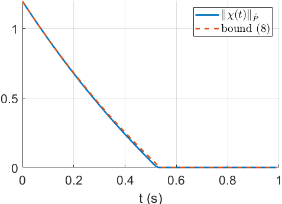
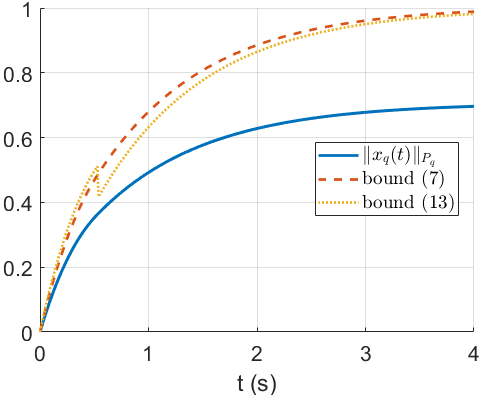
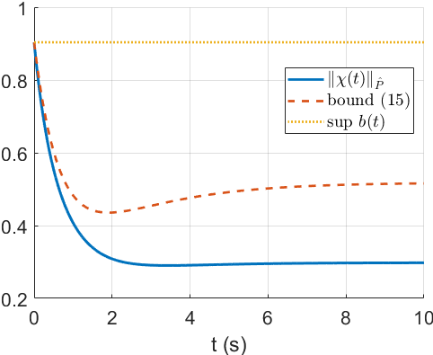
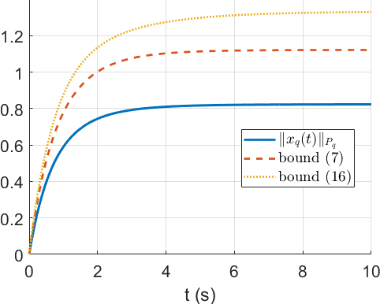
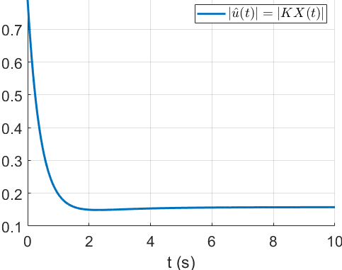
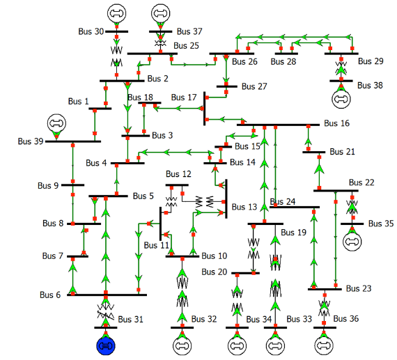

# Resilience of Linear Networks

Repository for the paper "Losing Control of your Network? Try Resilience Theory", which is available on [ArXiv](https://arxiv.org/abs/2306.16588) and submitted to the journal [IEEE Transactions on Control of Network Systems](https://ieeexplore.ieee.org/xpl/RecentIssue.jsp?punumber=6509490).
Here are all the codes and data necessary to reproduce the simulations of the paper.
We study three different scenarios:
- a fully actuated 3-component network losing control over one of its actuators;
- an underactuated 3-component network losing control over one of its actuators;
- the IEEE 39-bus system losing control over one of its generator buses.


## Fully actuated 3-component network

This is an academic example aimed at illustrating the resilience theory for fully actuated systems.
The dynamics of the network are:
```math
\dot \chi(t) = \left(\begin{array}{cc} -1 & 0.3 \\ 0.3 & -1 \end{array}\right) \chi(t) + \begin{bmatrix} 2 & 0 \\ 0 & 2 \end{bmatrix} \hat{u}(t) + \begin{bmatrix} 0.3 \\ 0.3 \end{bmatrix} x_q(t),
```
```math
\dot x_q(t) = -x_q(t) + u_q(t) + 2w_q(t) + \begin{array} 0.3 & 0.3 \end{array} \chi(t),
```
with
```math
\chi(0) = \begin{bmatrix} 1 \\ 1 \end{bmatrix}, \quad x_q(0) = 0, \quad \hat{u}(t) = \begin{bmatrix} \hat{u}_1(t) \\ \hat{u}_1(t) \end{bmatrix} \in \hat{\mathcal{U}} = [-1, 1]^2,
```
$u_q(t) \in \mathcal{U}_q = [-1, 1]$ and $w_q(t) \in \mathcal{W}_q = [-1, 1]$.
After a cyber-attack we lose control authority over the actuator producing $w_q$
Notice that control input $u_q$ cannot overcome all undesirable inputs $w_q$.
Then, we want to bound how far away from the origin can $x_q$ be driven by $w_q$ despite our best effort with $u_q$.
To do so, we first solve Lyapunov equations $A_q^\top P_q + P_q A_q = -Q_q$ and $(\hat{A}+\hat{D})^\top \hat{P} + \hat{P} (\hat{A}+\hat{D}) = -\hat{Q}$ with the function `lyap` on MATLAB:
```math
Q_q = 1, \quad P_q = 0.5, \quad \hat{Q} = \begin{bmatrix} 1 & 0 \\ 0 & 1 \end{bmatrix},\quad \text{and}\quad \hat{P} = \begin{bmatrix} 0.23 & 0.05 \\ 0.05 & 0.5 \end{bmatrix}.
```
Then, the resilient stabilizability conditions established in this paper are satisfied: $\gamma \gamma_q = 0.25 < \alpha \alpha_q = 0.7$ and $\gamma z_{max}^{P_q} = 0.5 < \alpha_q b_{min}^{\hat{P}} = 2$.
As shown below, $\chi$ is indeed resiliently stabilizable in finite time by $\hat{B}\hat{u} = \frac{-\chi(t)}{\|\chi(t)\|_{\hat{P}}} b_{min}^{\hat{P}}$.



The state $x_q$ of the malfunctioning system can also be bounded even in the worst-case scenario as shown below.



These simulations are performed with `test_full_actuation.m`.


## Underactuated 3-component network




The state $x_q$ of the malfunctioning system can also be bounded even in the worst-case scenario as shown below.






These simulations are performed with `test_underactuation.m`.


## IEEE 39-bus system

Picture of the [IEEE 39-bus system](https://icseg.iti.illinois.edu/ieee-39-bus-system/) from [1].



We obtain the linearized network equation from [2].
After the loss of control authority over generator bus 39, we split the network state between $x_q = \big( \delta_{39}, \dot \delta_{39} \big)$ and $\chi$ for the remaining states.


## File Structure

- `main_IEEE_net.m` runs the simulation and compute bounds on the network states.
- `Pnorm.m` calculates the $P$-norm of a vector $x$ as $\\|x\\|_P = \sqrt{x^\top P x}$, where $P$ is a positive definite matrix.


## Citation
```
@article{bouvier2023networks,  
  title = {Losing Control of your Network? Try Resilience Theory},   
  author = {Jean-Baptiste Bouvier and Sai Pushpak Nandanoori and Melkior Ornik},    
  journal = {},    
  year = {2023},   
  volume = {},
  pages = {},
  doi = {}
}
```


## Contributors

- [Jean-Baptiste Bouvier](https://jean-baptistebouvier.github.io/)
- [Sai Pushpak Nandanoori](https://sites.google.com/view/saipushpakn)
- [Melkior Ornik](https://mornik.web.illinois.edu/)


## References

[1] T. Athay, R. Podmore, and S. Virmani, [“A practical method for the direct analysis of transient stability,”](https://ieeexplore.ieee.org/abstract/document/4113518) IEEE Transactions on Power Apparatus and Systems, vol. PAS-98, no. 2, pp. 573 – 584, 1979.

[2] S. P. Nandanoori, S. Kundu, J. Lian, U. Vaidya, D. Vrabie, and K. Kalsi, [“Sparse control synthesis for uncertain responsive loads with stochastic stability guarantees,”]( https://ieeexplore.ieee.org/abstract/document/9489331) IEEE Transactions on Power Systems, vol. 37, no. 1, pp. 167 – 178, 2022.
