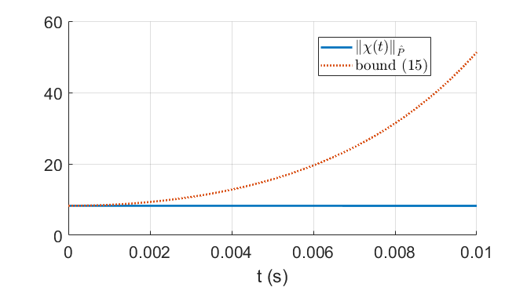

# Resilience of Linear Networks

Repository for the paper "Losing Control of your Network? Try Resilience Theory", which is available on [ArXiv](https://arxiv.org/abs/2306.16588) and submitted to the journal [IEEE Transactions on Control of Network Systems](https://ieeexplore.ieee.org/xpl/RecentIssue.jsp?punumber=6509490).
Here are all the codes and data necessary to reproduce the simulations of the paper.
We study three different scenarios:
- a fully actuated 3-component network losing control over one of its actuators;
- an underactuated 3-component network losing control over one of its actuators;
- the IEEE 39-bus system losing control over one of its generator buses.


## Fully actuated 3-component network

This is an academic example aimed at illustrating the resilience theory for fully actuated systems. The dynamics of the network are
```\math
\begin{align}
    \dot \chi(t) &= \begin{bmatrix} -1 & 0.3 \\ 0.3 & -1 \end{bmatrix} \chi(t) + \begin{bmatrix} 2 & 0 \\ 0 & 2 \end{bmatrix} \hat{u}(t) + \begin{bmatrix} 0.3 \\ 0.3 \end{bmatrix} x_q(t), \label{eq:academic X} \\
    \dot x_q(t) &= -x_q(t) + u_q(t) + 2w_q(t) + \begin{bmatrix} 0.3 & 0.3 \end{bmatrix} \chi(t), \label{eq:academic x_q}
\end{align}
```
with
\begin{equation*}
    \chi(0) = \begin{bmatrix} 1 \\ 1 \end{bmatrix}, \quad x_q(0) = 0, \quad \hat{u}(t) = \begin{bmatrix} \hat{u}_1(t) \\ \hat{u}_1(t) \end{bmatrix} \in \hat{\mathcal{U}} = [-1, 1]^2,
\end{equation*}
$u_q(t) \in \mathcal{U}_q = [-1, 1]$ and $w_q(t) \in \mathcal{W}_q = [-1, 1]$.


## Underactuated 3-component network

## IEEE 39-bus system

Picture of the [IEEE 39-bus system](https://icseg.iti.illinois.edu/ieee-39-bus-system/) from [1].


We obtain the linearized network equation from [2].
After the loss of control authority over generator bus 39, we split the network state between $x_q = \big( \delta_{39}, \dot \delta_{39} \big)$ and $\chi$ for the remaining states.




## File Structure

- `main_IEEE_net.m` runs the simulation and compute bounds on the network states.
- `Pnorm.m` calculates the $P$-norm of a vector $x$ as $\\|x\\|_P = \sqrt{x^\top P x}$, where $P$ is a positive definite matrix.


## Citation
```
@article{bouvier2023networks,  
  title = {Losing Control of your Network? Try Resilience Theory},   
  author = {Jean-Baptiste Bouvier and Sai Pushpak Nandanoori and Melkior Ornik},    
  journal = {},    
  year = {2023},   
  volume = {},
  pages = {},
  doi = {}
}
```


## Contributors

- [Jean-Baptiste Bouvier](https://jean-baptistebouvier.github.io/)
- [Sai Pushpak Nandanoori](https://sites.google.com/view/saipushpakn)
- [Melkior Ornik](https://mornik.web.illinois.edu/)


## References

[1] T. Athay, R. Podmore, and S. Virmani, [“A practical method for the direct analysis of transient stability,”](https://ieeexplore.ieee.org/abstract/document/4113518) IEEE Transactions on Power Apparatus and Systems, vol. PAS-98, no. 2, pp. 573 – 584, 1979.

[2] S. P. Nandanoori, S. Kundu, J. Lian, U. Vaidya, D. Vrabie, and K. Kalsi, [“Sparse control synthesis for uncertain responsive loads with stochastic stability guarantees,”]( https://ieeexplore.ieee.org/abstract/document/9489331) IEEE Transactions on Power Systems, vol. 37, no. 1, pp. 167 – 178, 2022.
